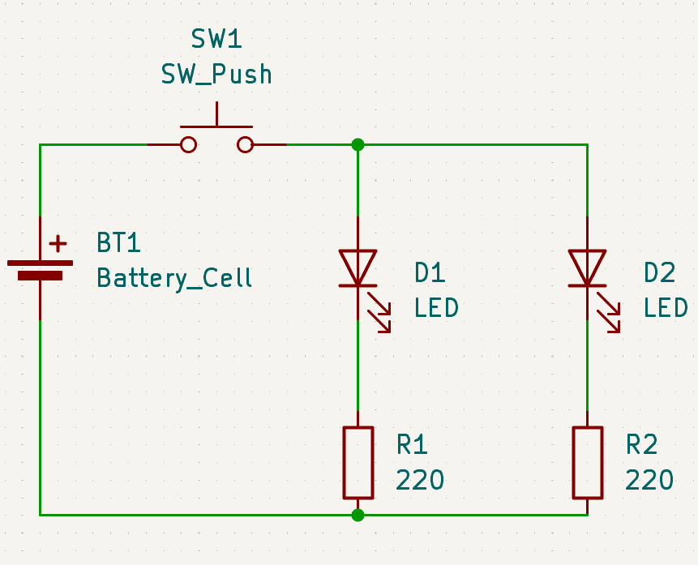
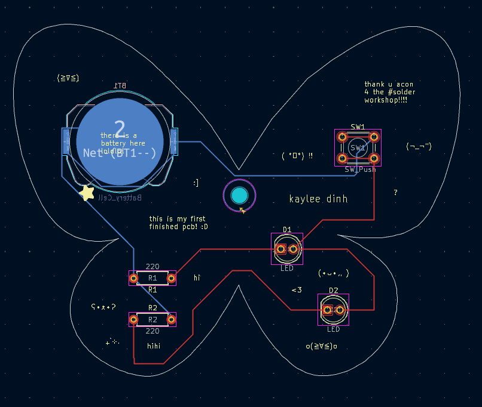
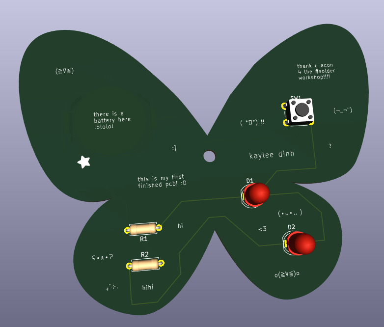
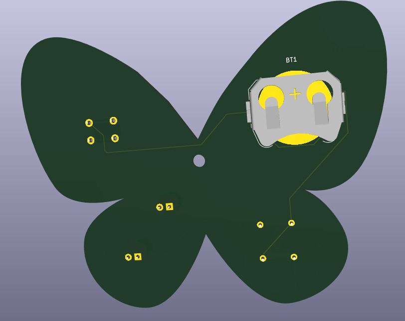
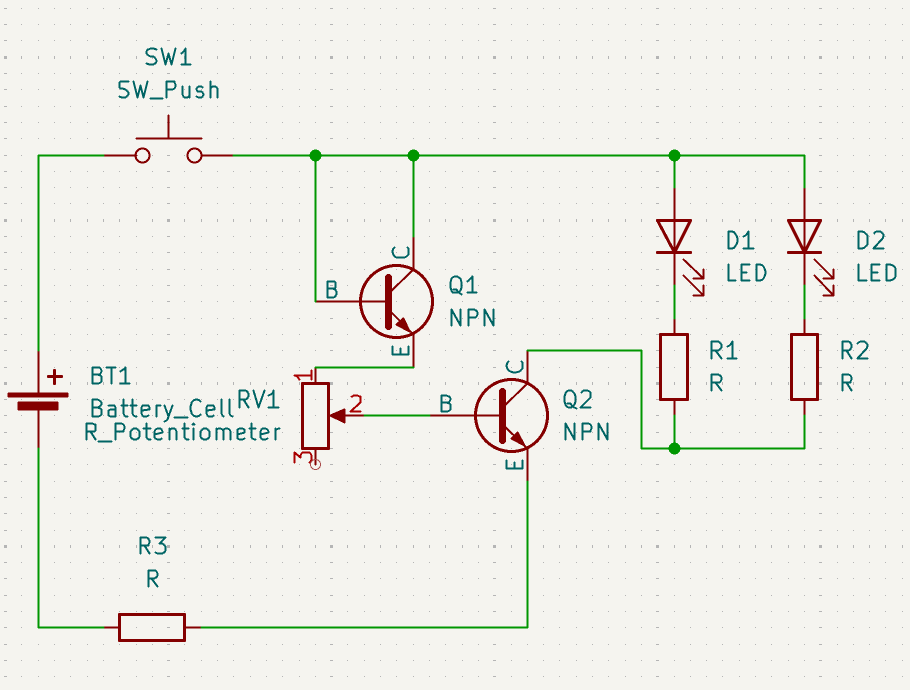
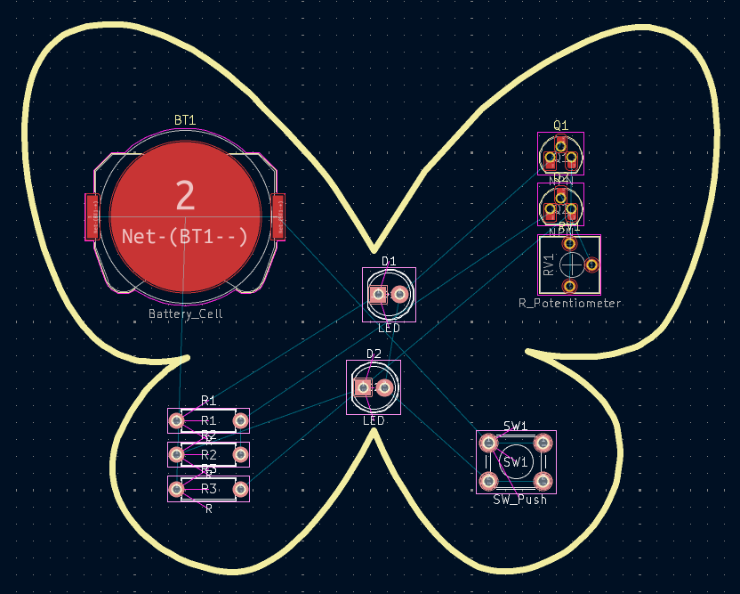
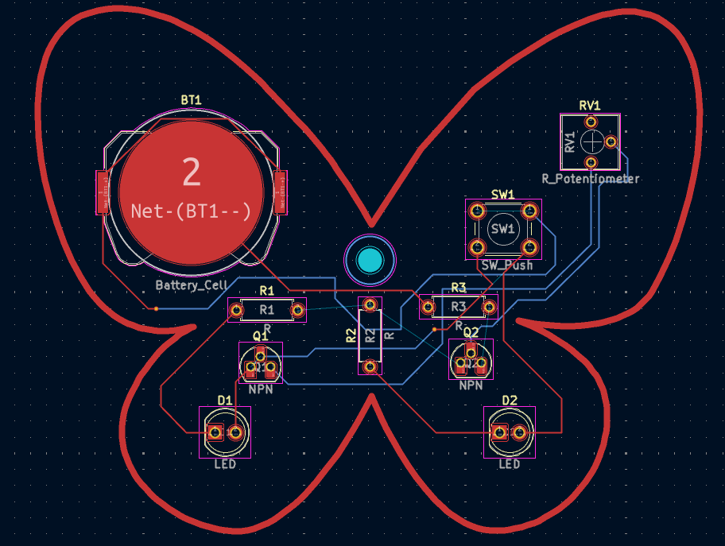
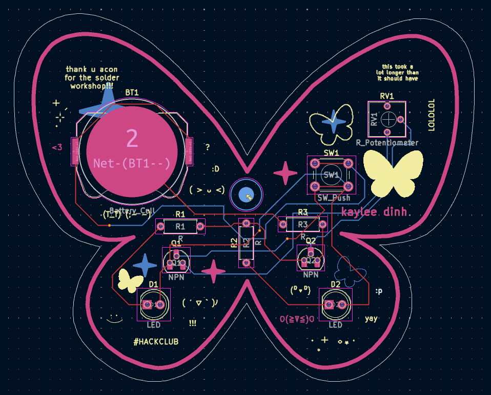
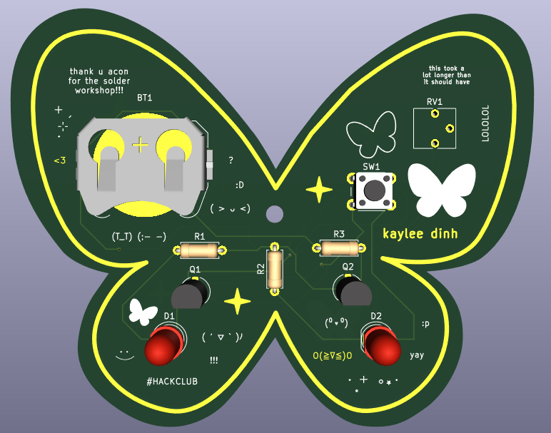
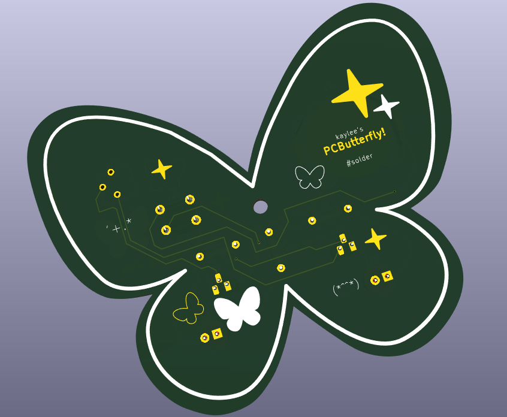

**Total time spent: 7h**

# June 4th: Made my first iteration of the PCB design.

I used KiCad and created a schematic similar to what was taught in acon's Solder workshop.
Because I'm making my own PCB for the first time, it took a lot of trial and error to figure out how everything worked. Assigning footprints and migrating from the Schematic Editor to the PCB Editor was tricky, but I think I'm getting the hang of it.
I wired my components, as well as decorated the front side with silkscreen text.

**Time spent: 2h**

# June 27th: On my fifth iteration. I made an entirely new schematic and design.

It's been a while since my first iteration. I've had this project open for more than three weeks, and I've learned lots more since then. Now, I want my PCB to be more complex, so I created a new schematic with a potentiometer and transistors, which I had simulated with Falstad.

# June 28th: Finished routing, added silkscreen and copper designs, fixed errors.

Another Hack Clubber taught me that I can make shiny silkscreen by putting my designs on the copper layer and the solder mask layer (Thank you). I had good fun incorporating both silkscreen and copper designs. Oh! By the way, the butterfly and star designs were vectors I made in Figma, exported as SVGs, and imported into KiCad as graphics.

For a while, I had an error because I used the same graphic for my silkscreen/copper outline as the Edge Cuts board outline. I tried rescaling the outlines to make them not overlap, but that was taking too long--I eventually opened Figma again to make an outline just for the Edge Cuts.

Anyways, I'm finally going to submit this! As I'm writing this, it's 5:59 AM. Here are the fruits of my labor.

