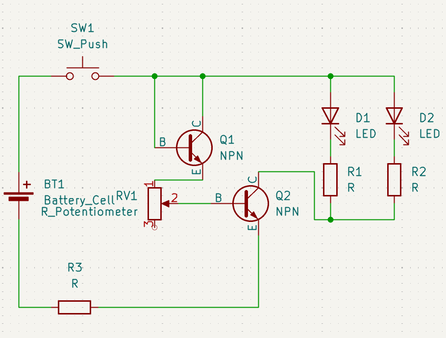
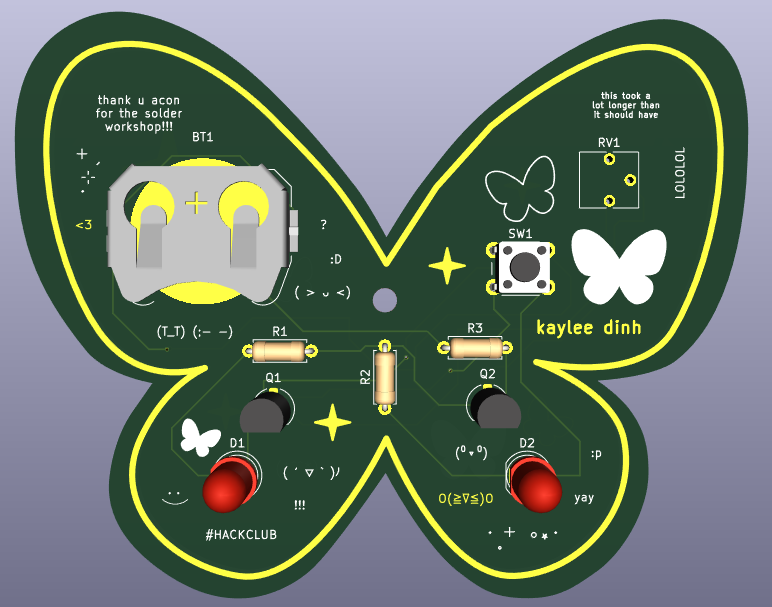

# This is a design of a butterfly PCB keychain!

I'm submitting it for Solder by Hack Club.
The butterfly shape is based on resin shaker keychains that were somewhat popular for a bit during quarantine. I followed the shape of the resin shaker mold, making a butterfly SVG vector in Figma that I put on the Edge Cuts layer, making the PCB design in KiCad. This design is 89.1418 mm x 70.5458 mm.

## Materials
- Battery Holder (1)
- Push Button (1)
- LED 5.0mm (2)
- 220 Resistor (3)
- NPN Transistor (2)
- Potentiometer (1)

## Schematic

## PCB

## 3D View: Front

## 3D View: Back

Made by `@Kaylee` on slack

Made for http://solder.hackclub.com/ and https://highway.hackclub.com/
